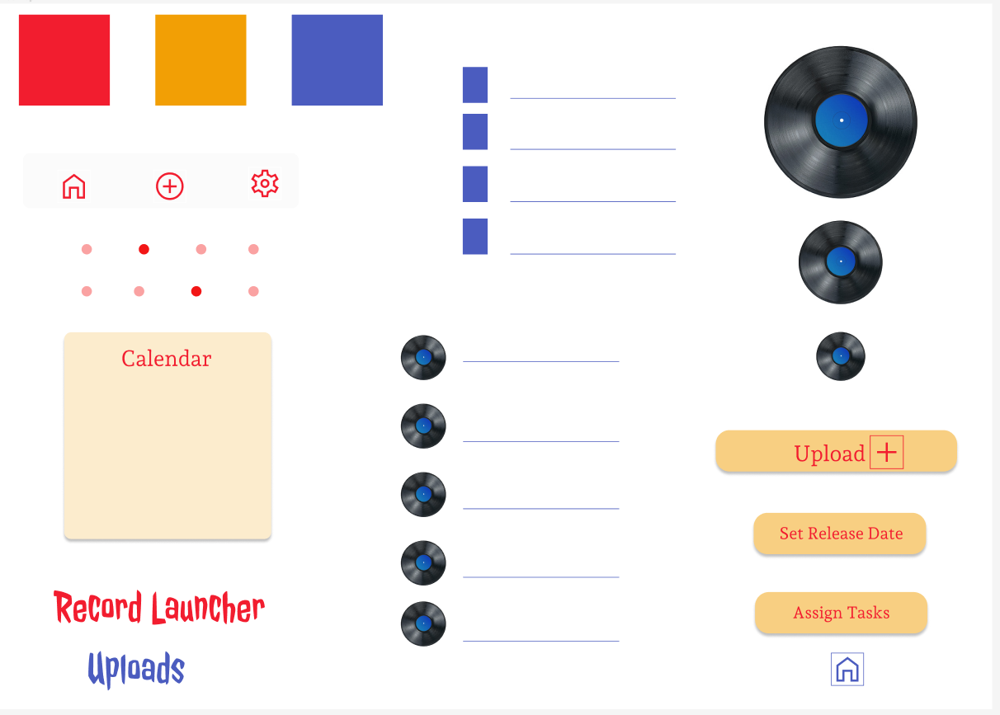

# lofi-and-figma-gallery

Repo to display analog and digital lo-fi designs and prototypes for UX case studies.

## ABOUT

This repo will become a gallery for UX Design case studies, including wireframes, mockups, digital prototypes, etc.

### Examples

.png)