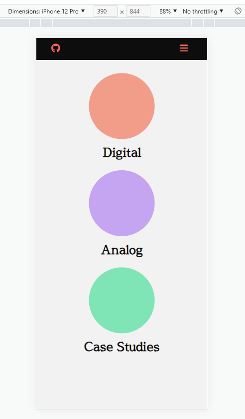
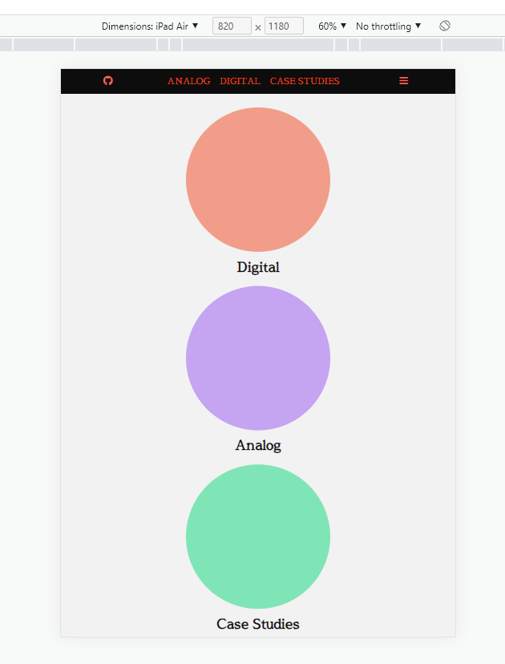
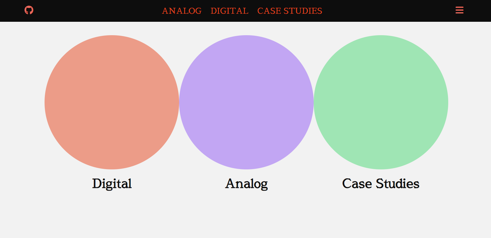

# lofi-and-figma-gallery

Repo to display analog and digital lo-fi designs and prototypes for UX case studies.

## ABOUT

This repo is a gallery for sketches, wireframes, mockups, digital prototypes, and other analog artifacts.

### Screenshots

### Screencasts

